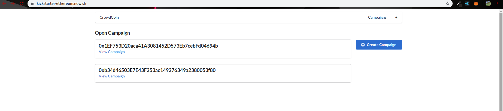
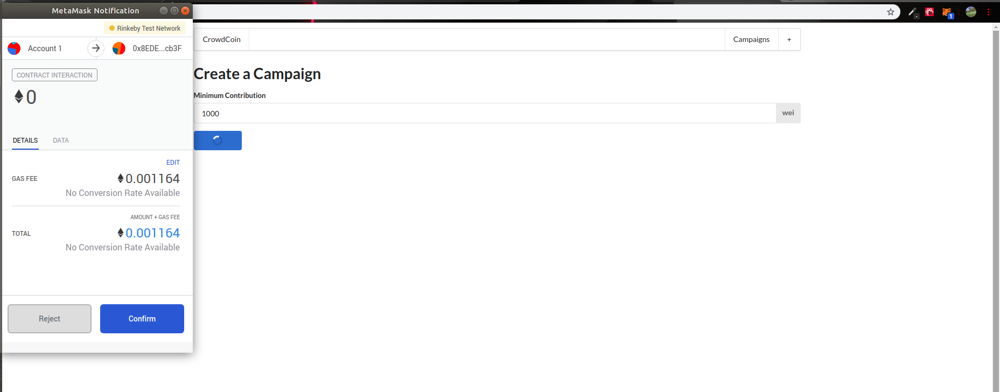
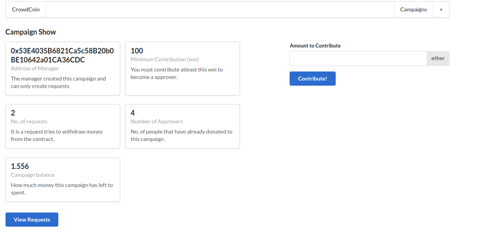
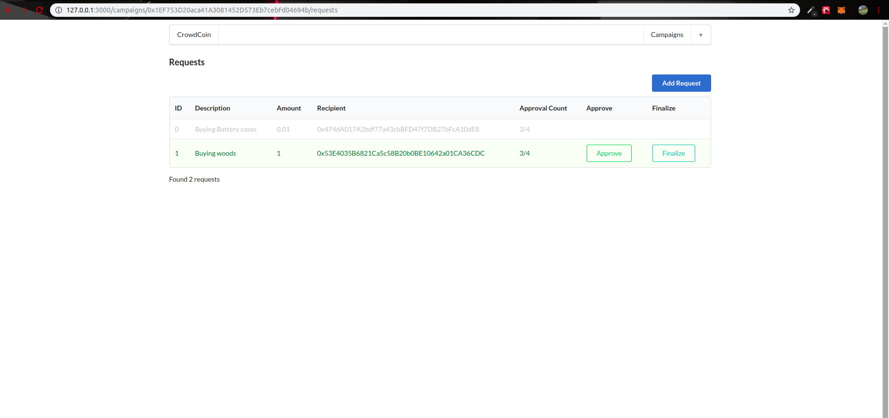
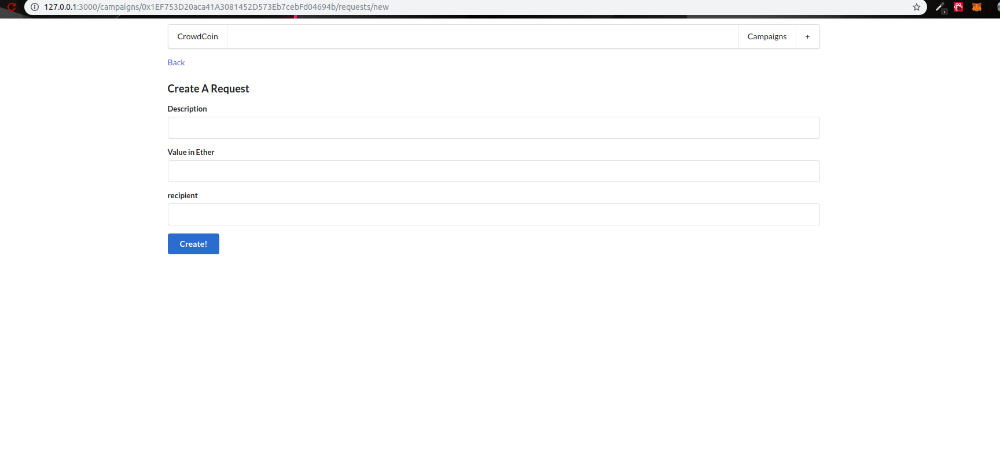

# ETHstarter - Fixing Kickstarter issues of fraud

## What is Kickstarter
Kickstarter PBC is a funding platform for creative projects. Kickstarter is a website where anyone can raise and collect money to new build their innovative startup ideas (known as a campaign). you just have to publish your idea and startup collecting donations and contributors.

## Problem with Kickstarter
Some malicious project owners don't spend their money on building their projects or can't manage the budget efficiently. In summary, money goes to project the owner and then it's their choice whether to spend it for building that project(with the help of vendors) or flee.

## Solution
A simple solution to this is that we send money to an ethereum contract for a specific campaign. Then the owner can only spend the money by sending it to a specified vendor's address. Now to enhance more security contributors/donators can vote if a money spending to a vendor should be allowed or not(by checking the authenticity of vendor's ethereum account address) if voting passes a specific percentage the transaction is allowed to happen otherwise not.

## Functionaity
- User (owner) create a campaign on '/' route.
- any user can view the campaign and contribute to the campaign.
- owner can make request for ETH transfer to a vendor for e.g. buying batteries.
- users can vote for a vendor ETH transfer request.
- if vote percentage is above 50%, owner can initiate the transfer to vendor otherwise it will fail.

# Demo


---


---


---


---


# Tech-Used
- Nextjs
- Reactjs
- Nodejs
- Solidity
- web3.js

## Usage
```node
npm run dev // for dev-server
npm run build // for build files
```

## Contributing
Pull requests are welcome. For major changes, please open an issue first to discuss what you would like to change.

Please make sure to update tests as appropriate.

## License
[Apache](https://choosealicense.com/licenses/apache-2.0/)
